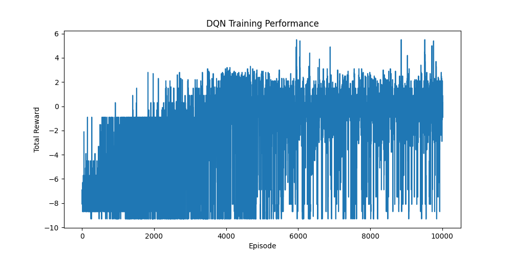

# 🐦 Flappy Bird DQN Reinforcement Learning

A Reinforcement Learning project that teaches an AI agent to play **Flappy Bird** using a **Deep Q-Network (DQN)**.

The agent learns through trial and error by interacting with the Flappy Bird environment. It receives a state from the game, selects an action, receives a reward or penalty, and gradually learns a policy that allows it to avoid pipes and achieve higher scores.

## 📌 Project Overview

This project implements a DQN-based Reinforcement Learning agent for Flappy Bird.

Instead of manually programming the bird to avoid pipes, the agent learns how to play the game by repeatedly interacting with the environment.

The learning process follows:

**State → Action → Reward → Next State → Learning**

The DQN approximates the Q-value function and estimates how valuable each possible action is for a given game state.

## 🎯 Objective

The main objective is to train an agent that learns to:

* Keep the bird alive.
* Avoid collisions with pipes.
* Pass through pipes successfully.
* Maximize its cumulative reward.
* Improve its performance through repeated gameplay.

## 🧠 Reinforcement Learning Approach

The project uses **Deep Q-Learning**, which combines:

* Reinforcement Learning
* Q-Learning
* Neural Networks
* Experience Replay
* Epsilon-Greedy exploration

### State

The agent receives information about the current game situation, such as the bird's position and its relationship to the upcoming pipe.

### Actions

The agent chooses between available actions, such as:

* **Flap**
* **Do nothing**

### Rewards

The environment provides rewards based on the agent's actions and game outcome.

The agent learns which actions lead to better long-term results rather than simply memorizing individual moves.

## 🧩 DQN Architecture

The Deep Q-Network takes the current game state as input and produces a Q-value for each possible action.

The action with the highest predicted Q-value is selected during exploitation.

The network is trained using the difference between the predicted Q-value and the target Q-value.

Conceptually:

```text
Game State
    ↓
Neural Network
    ↓
Q-values for actions
    ↓
Select Action
    ↓
Flappy Bird Environment
    ↓
Reward + Next State
    ↓
Experience Replay
    ↓
Train DQN
```

## 🔄 Experience Replay

The project uses an **experience replay buffer** to store previous experiences in the form:

```text
(state, action, reward, next_state, done)
```

During training, random batches of experiences are sampled from the replay buffer.

This helps:

* Reduce correlations between consecutive experiences.
* Improve training stability.
* Reuse previous experiences.
* Make learning more efficient.

## 🎲 Epsilon-Greedy Exploration

The agent uses an epsilon-greedy strategy to balance exploration and exploitation.

At the beginning of training, the agent explores more by selecting random actions.

As training progresses, epsilon decreases and the agent increasingly chooses actions based on the DQN's predictions.

```text
High epsilon
    ↓
More exploration
    ↓
Learning
    ↓
Lower epsilon
    ↓
More exploitation
```

## 📂 Project Structure

```text
flappy-bird-dqn-reinforcement-learning/
│
├── agent.py
├── dqn.py
├── experience_replay.py
├── game_flappy_bird.py
├── parameters.yaml
├── training_graph.png
├── README.md
└── .gitignore
```

### `agent.py`

Contains the main Reinforcement Learning agent and training logic.

### `dqn.py`

Defines the Deep Q-Network used to approximate Q-values.

### `experience_replay.py`

Implements the experience replay buffer used for storing and sampling past experiences.

### `game_flappy_bird.py`

Contains the Flappy Bird game environment implemented using Pygame.

### `parameters.yaml`

Stores configurable hyperparameters used during training.

### `training_graph.png`

Visualization of the training performance and learning progress.

## 🛠️ Technologies Used

* **Python**
* **PyTorch**
* **Pygame**
* **NumPy**
* **PyYAML**
* **Reinforcement Learning**
* **Deep Q-Network (DQN)**

## ⚙️ Installation

Clone the repository:

```bash
git clone https://github.com/sbuttam18-pja/flappy-bird-dqn-reinforcement-learning.git
```

Navigate into the project:

```bash
cd flappy-bird-dqn-reinforcement-learning
```

Install the required dependencies:

```bash
pip install torch pygame numpy pyyaml
```

## ▶️ Running the Project

Run the agent:

```bash
python agent.py
```

The training configuration can be modified in:

```text
parameters.yaml
```

You can adjust parameters such as the learning rate, discount factor, exploration rate, batch size, and number of training episodes according to your experiment.

## 📊 Training Results

The training performance is visualized in:



The graph can be used to observe how the agent's performance changes as training progresses.

Typically, successful training should show an improvement in the agent's ability to survive longer and achieve higher rewards over time.

## 🚀 Key Concepts Demonstrated

This project demonstrates practical implementation of:

* Reinforcement Learning
* Deep Q-Learning
* Markov Decision Process concepts
* Q-value approximation
* Neural-network-based decision making
* Experience Replay
* Epsilon-Greedy exploration
* Reward design
* Hyperparameter configuration
* RL training and evaluation
* Pygame environment interaction
* PyTorch model training

## 🔮 Future Improvements

Possible improvements include:

* Add a target network for more stable DQN training.
* Implement Double DQN.
* Experiment with different neural-network architectures.
* Tune the reward function.
* Add model checkpoint saving and loading.
* Compare different exploration strategies.
* Track the maximum score achieved during training.
* Add a trained-agent demonstration/GIF.
* Compare DQN with other Reinforcement Learning approaches.

## 📚 Learning Outcome

This project helped demonstrate how a Reinforcement Learning agent can learn a game-playing strategy through interaction with an environment rather than being explicitly programmed with the rules for making every decision.

It also provides practical experience with **PyTorch, neural networks, experience replay, exploration vs. exploitation, and Deep Q-Learning**.

## 👨‍💻 Author

**sbuttam18-pja**

GitHub:
https://github.com/sbuttam18-pja

---

⭐ If you find this project useful or interesting, feel free to star the repository!
